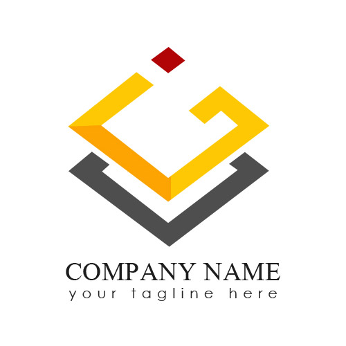

background-image: url(img/pres-title-bg.png)
class: title-slide

# Our Product
# Your people, transformed

Prepared for Your Lovely Name

.customer[]

.logo[]

.version[Author: --- Version: draft v0.1]

---
layout: true

<strong>Revolution through Evolution.</strong>

---
class: center, white, footer
background-image: url(img/jumping-man.jpeg)

.credit[Photo by KAL VISUALS on Unsplash]

# *Digital* Transformation is everywhere, but how do *People* fit in?

.space.x5[
.text-black[\#successishuman]
]

---
class:white,footer,center
background-image: url(img/gantry2.jpeg)

# Change is accelerating

.left[
### Evolution of People Leadership
* 1930s: Labour Manager
* 1960s: Personal Manager
* 1980s: Human Resources
* 2010s: People & Performance
]
.right[
### Changing nature of work
* Job for life vs. gig economy
* Boomers vs. Millenials
* New models of leadership
* Fast changing skills and technology
]

.credit[Photo by Roel Dierckens on Unsplash]

---
class:black,white

.left[
# Strategy & Structure
- Shape capabilities and build flexible and adaptive power
- Perfectly align with strategic imperatives
- Bring strategy to life

.hash[\#strategictraction]

]
 
.right.smallish.tight[
.fade[
### Old world:
- Cumbersome Excel documents and Powerpoint presentations
- Long feedback cycles
- No integration with Operating Model
- Difficult to assess impacts of change
]
### New world:
- What-if scenario modelling
- Traceable to strategic business drivers
- Collaborative and rapid feedback
- Insight-driven optimisation
- Integrated change assessment
]

---
class:black,white

.left[
# Archetypes, Roles & Skills

- Craft roles and archetypes
- Build confidence and understanding
- Discover hidden talent

.hash[\#maatchfitsquads]

]
 
.right.smallish.tight[
.fade[
### Old world:
- Top-down "ideal" box models or bottom-up Org chart view
- People defined by current role not by individual skills
- No easy way to play and experiment
]
### New world:
- Fast facts from the ground-up
- Ability to calibrate roles to match strategy
- Spot, investigate, and recommend opportunities
- Prepare for change with stakeholder archetypes modeling
]

---
class:black,white

.left[
# Leadership Support
- Engage constructively with people-leaders
- Delegate confidently for rapid traction
- Delivers on-going value with simple tooling

.hash[\#oneteam]

]
 
.right.smallish.tight[
.fade[
### Old world:
- Informal information gathering
- Seen as more admin work
- Uneven buy-in
]
### New world:
- Rich and deep talent data
- People-leaders gain insights into their own teams
- Active support from grass-roots seeded before any change starts
]

---
class:black,white

.left[
# Professional Development
- Respond dynamically to market and industry changes
- Optimise strategic capabilities at individual level
- Seamlessly integrate your training options
- Track and report development to demonstrate strong ROI
- Empower your people for peak performance

.hash[\#makesuccessinevitable]

]
 
.right.smallish.tight[
.fade[
### Old world:
- Professional development ad-hoc and sometimes misaligned
- Generic training options
- Some suspect training benefits and business cases
- Tracking and monitoring tricky
]
### New world:
- P&P able to advocate for sustainable change - armed with hard facts and data that aligns to strategic drivers
- Targeted training of key capability strengths and weaknesses
- Agile and adaptable roll-out of updated professional development plans
]

---
class:black,white

.left[
# People Profiles
- Generate employee skill profiles
- Maintain real-time client-friendly consulting profiles
- Use gamefication to motivate high performance

.hash[\#transparentachievement]

]
 
.right.smallish.tight[
.fade[
### Old world:
- Integration between Job Description, actual role, and professional development informal at best
- Stale and missing profiles
- Career-path next-steps and alignment difficult to plot and measure
]
### New world:
- Real-time generation of standardised market-facing talent collateral for consultancies
- JDs, role definitions, and professional development in sync
- People motivated by very visible and clear expectations and goals
]

---
class:black,white

.left[
# title

.hash[\#mytag]

]
 
.right.smallish.tight[
.fade[
### Old world:

]
### New world:

]

---
class:black,white

.left[
# title

.hash[\#mytag]

]
 
.right.smallish.tight[
.fade[
### Old world:

]
### New world:

]

---
class:center,black
background-image: url(img/success.jpeg)

.credit[Photo by Ian Stauffer on Unsplash]
> "Give me a lever and a place to stand, and I will move the world" .attribution[Archimedes] 

.bold[You've chosen your place to stand. Secure your legacy.]
